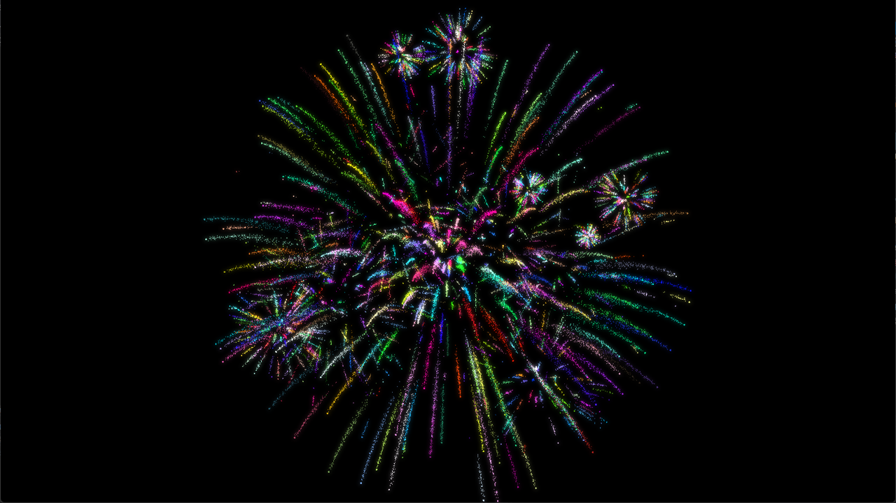
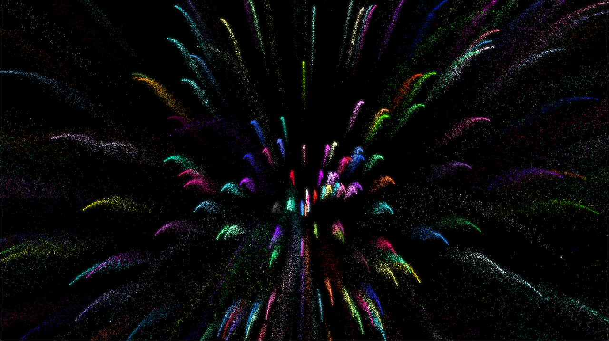
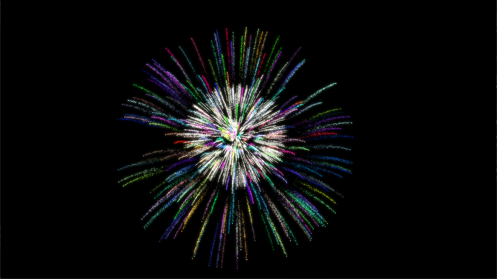
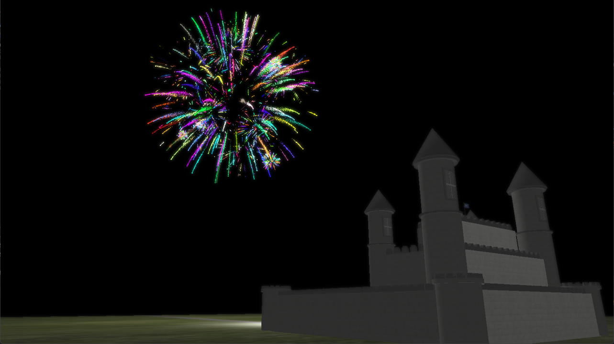
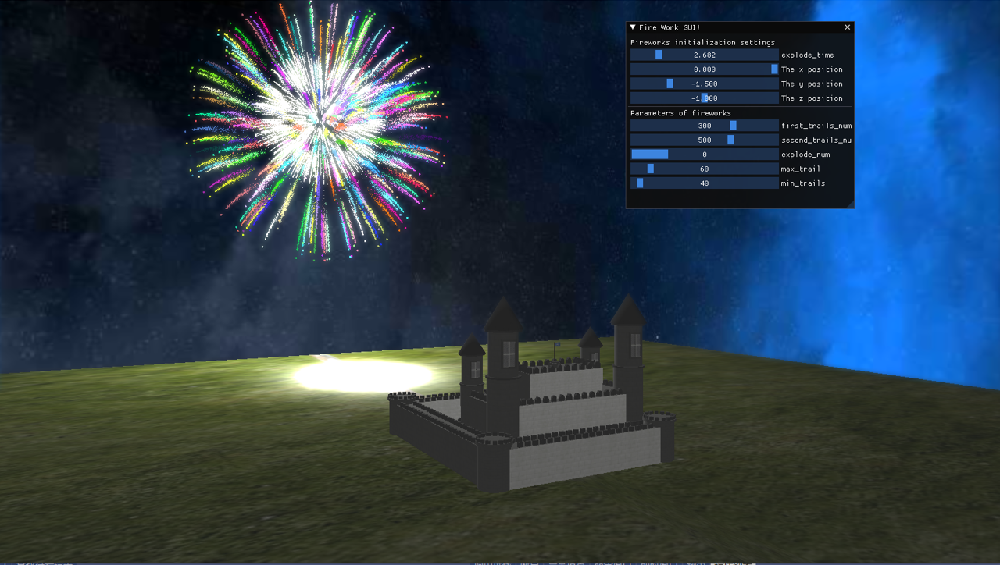

# Particle System: Firework


## Run the code

This project is developed using visual studio 2019 and is a cmake project, so theoretically it is cross platformed.

To run the code:

* clone the repo

  ```
  git clone https://github.com/zjnyly/CG_Firework.git
  ```

* enter build folder

  ```
  cd build
  ```

* generate `.sln`

  ```
  cmake ..
  ```

* open `.sln` and build in release mode, remember to set CG-Firework as your starting program

## Some incredible scenes














